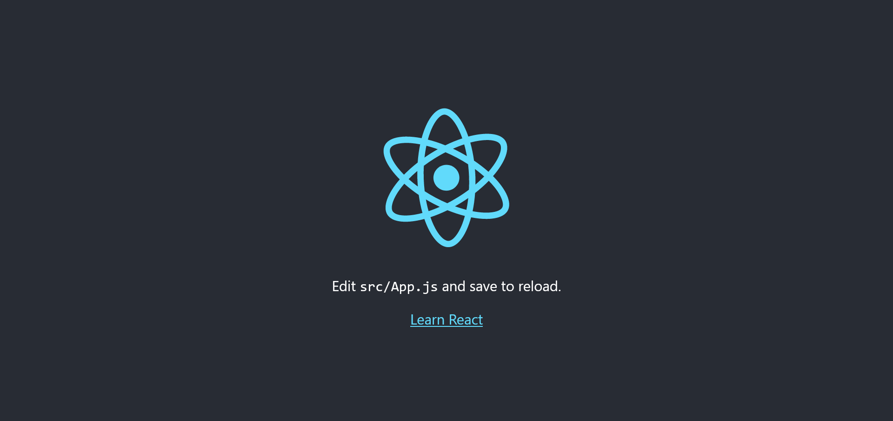
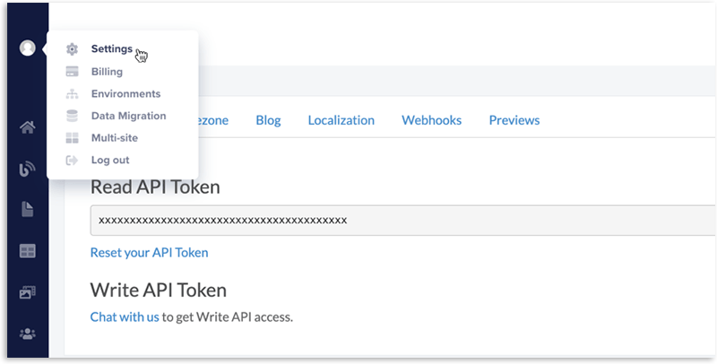
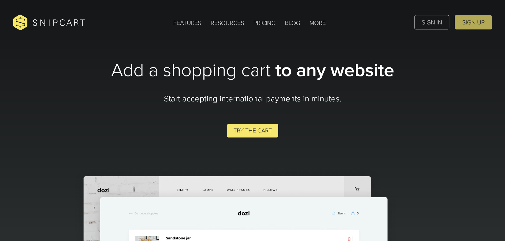
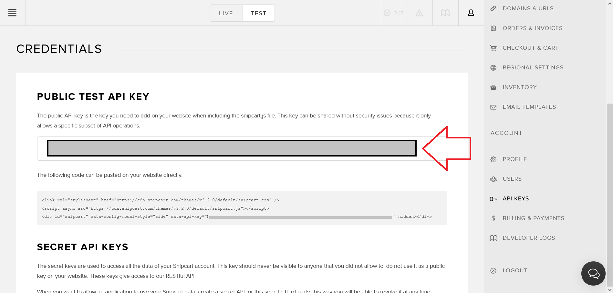
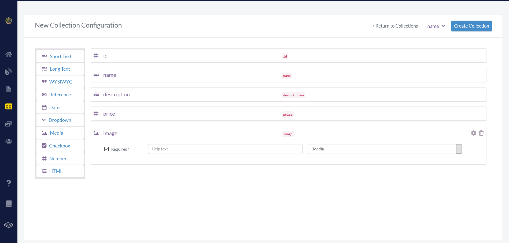
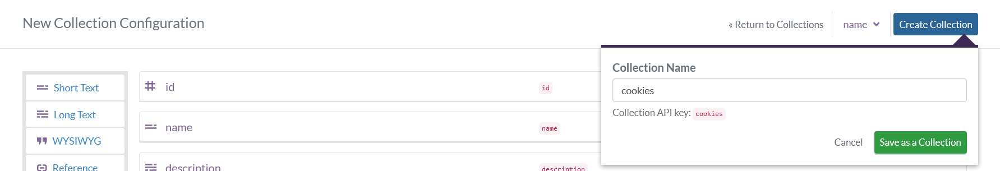
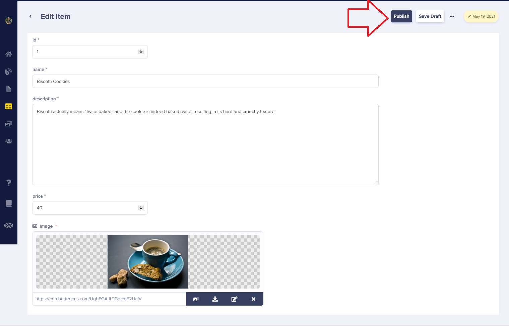
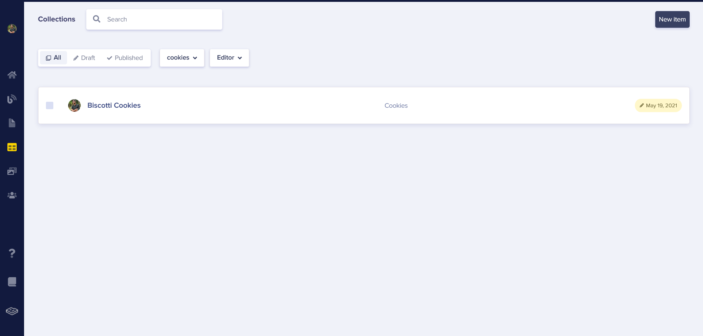
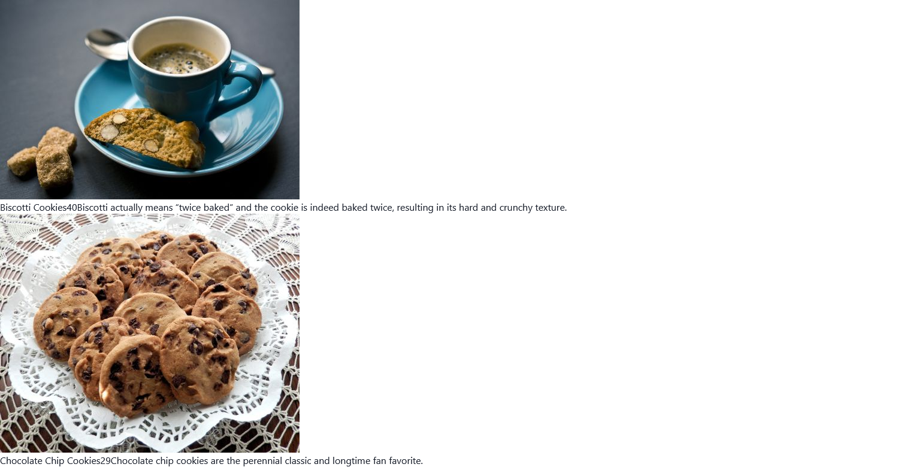
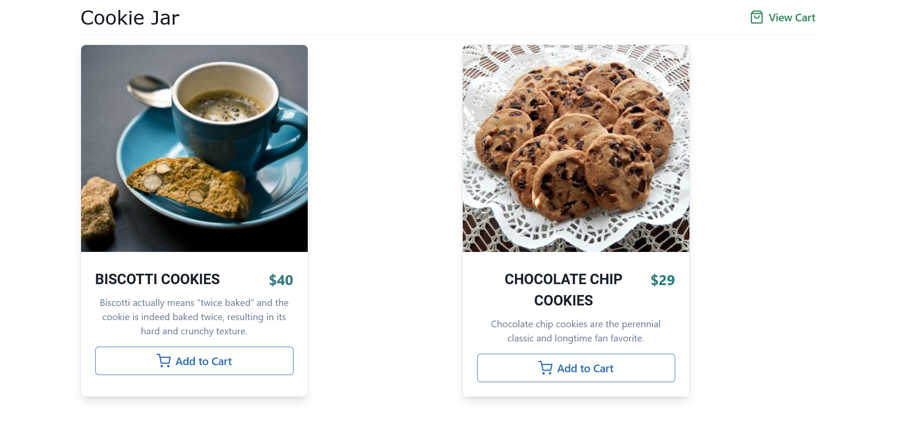

In this tutorial, we will build an E-commerce App with [React](https://reactjs.org/) using [ButterCMS](https://buttercms.com/) and [Snipcart](https://snipcart.com/). We will use [Chakra UI](https://chakra-ui.com/), a modular and accessible component library, to style the app.

If you want to jump right into the code, check out the [GitHub Repo here](https://github.com/lelouchB/react-ecommerce-butter).

And here's a link to the deployed version: [https://react-ecommerce-butter.vercel.app/](https://react-ecommerce-butter.vercel.app/).

## Prerequisites

- Knowledge of HTML, CSS & JavaScript
- Basic knowledge of [React](https://reactjs.org/)
- Node & NPM installed on the local development machine.
- Any code editor of your choice.
- [React Dev Tools](https://chrome.google.com/webstore/detail/react-developer-tools/fmkadmapgofadopljbjfkapdkoienihi?hl=en) (optional)
- A [Butter CMS Account](https://buttercms.com/)
- A [Snipcart Account](https://app.snipcart.com/register) (free forever in test mode)

## What is ButterCMS

[ButterCMS](https://buttercms.com/) is a SaaS start-up that delivers value to Developers and Marketers through a [headless, API-based CMS (Content Management System)](https://buttercms.com/blog/what-is-headless-cms) and blogging platform. Butter is a developer-friendly CMS that enables developers to build modern apps while also providing their marketing teams with the tools needed to make website content updates. 

## What is Snipcart

[Snipcart](https://snipcart.com/) is HTML based fully customizable shopping cart that you can integrate with any web stack in few simple steps and start accepting international payments in minutes. With Snipcart's management dashboard, you can track abandoned carts, sales, orders, customers, and more.

Snipcart works perfectly with Headless CMS like Butter and speeds up your development process, provides better security, and functionality to your ecommerce app.

## How to Setup and Install React

In this tutorial, you will use Create React App template to quickly create the initial React app. Run the following command in the terminal.

```bash
npx create-react-app react-ecommerce-butter
cd react-ecommerce-butter
npm start
```

The last command, `npm start`, will start the React development server on your system's port 3000.  Head over to [http://localhost:3000/](http://localhost:3000/) in your browser to view your React app.



You can stop the development server by hitting **CTRL+C** in the terminal. 

In this tutorial, you will use Chakra UI to style your ecommerce app. Run the following command to install Chakra UI.

```bash
npm i @chakra-ui/react @emotion/react@^11 @emotion/styled@^11 framer-motion@^4 react-icons
```

Update `src/index.js` to wrap your react app with the `ChakraProvider` component.

```jsx
import React from "react";
import ReactDOM from "react-dom";
import "./index.css";
import App from "./App";
import reportWebVitals from "./reportWebVitals";
import { ChakraProvider } from "@chakra-ui/react";

ReactDOM.render(
  <React.StrictMode>
    <ChakraProvider>
      <App />
    </ChakraProvider>
  </React.StrictMode>,
  document.getElementById("root")
);

reportWebVitals();
```

Create a `.env` file to store ButterCMS and Snipcart API keys securely as environment variables. Run the following command to create the `.env` file.

```bash
touch .env
```

The next step is to create a [free ButterCMS account](https://buttercms.com/). After creating an account, head over to [https://buttercms.com/settings/](https://buttercms.com/settings/) and copy the **Read API Token**.



Navigate to [https://app.snipcart.com/register](https://app.snipcart.com/register) in your browser and create a free Snipcart account if you haven't already.



After creating the Snipcart account, head over to [account settings](https://app.snipcart.com/?ReturnUrl=%2fdashboard%2faccount%2fcredentials) and copy the **PUBLIC TEST API KEY** under Credentials.



Paste both Butter CMS API Key and Snipcart Public Test API Key in the `.env` file as shown below.

```bash
REACT_APP_BUTTER_ECOMMERCE=''
REACT_APP_SNIPCART_KEY=''
```

## How To Create Products on Butter

In this section, you will create the products for your ecommerce app on Butter. In this tutorial, you will create an ecommerce platform named **Cookie Jar**, where customers can buy different varieties of cookies. Hence, the products for this ecommerce platform will be **cookies**. 

Navigate to your [Butter Dashboard](https://buttercms.com/content/collections/) and then create a new collection named **cookies** with the following fields. 

- `id` - Type: `Number` - `isRequired`
- `name` - Type: `Short Text` - `isRequired`
- `description` - Type: `Long Text` - `isRequired`
- `price` - Type: `Number` - `isRequired`
- `image` - Type: `Media` - `isRequired`

You can create an ecommerce app on any product like shoes, sports stuff, craft, etc. You can add additional fields like ratings, reviews, stock, etc., to your ecommerce app, but these are the bare minimum required for any ecommerce app.

You can add the fields by dragging and dropping the corresponding field types.



After adding the fields, click on the **Create Collection** button, name the collection `cookies`, and hit **Save as a Collection**.



You will also need to add some dummy data to the `cookies` collection. You can either copy the dummy data from [https://react-ecommerce-butter.vercel.app/](https://react-ecommerce-butter.vercel.app/) or add your favorite cookies.

Make sure to hit **Publish** after adding the cookies, aka products. You can come back and add more products or edit them whenever you want.



Here is how your `cookies` collection will look after adding products to it.



## How To Fetch and Display Products

In this section, you will fetch the data  from Butter CMS and display them as products on your ecommerce app. 

You will use the `buttercms` library to fetch data from ButterCMS. Run the following command in your project's root directory to install `buttercms`.

```bash
npm i buttercms
```

Update `App.js` file with the following code.

```jsx
import { useState, useEffect } from "react";
import Butter from "buttercms";

const butter = Butter(process.env.REACT_APP_BUTTER_ECOMMERCE);

function App() {
  const [products, setProducts] = useState([]);

  useEffect(() => {
    async function fetchData() {
      const res = await butter.content.retrieve(["cookies"], {
        order: "name",
      });
      const { data } = await res.data;
      const allProducts = data.cookies;
      setProducts(allProducts);
    }
    fetchData();
  }, []);
  return (
    <div>
      {products.map((product) => (
        <div>
          
          {product.name}
          {product.price}
          {product.description}
        </div>
      ))}
    </div>
  );
}

export default App;
```

In the above code, you start by creating an instance of `Butter` using your ButterCMS API key stored in `.env` file and accessed using `process.env.REACT_APP_BUTTER_ECOMMERCE`. 

Then you create a state named `products` to store the data fetched from ButterCMS using the `useState()` hook. Hooks are functions that use React features like defining a state without writing a class.

You fetch the collection named `cookies` using butter's `.retrieve()` method inside the React's `useEffect()` hook.

You then access the response from ButterCMS and store it inside the `products` state using the `setProducts()` method. Here is how the state `products` look like.

```json
[
  {
    "meta": {
      "id": 125151
    },
    "id": "1",
    "name": "Biscotti Cookies",
    "price": 40,
    "description": "Biscotti actually means “twice baked” and the cookie is indeed baked twice, resulting in its hard and crunchy texture.",
    "image": "https://cdn.buttercms.com/UqbFGAJLTGqtYqF2UajV"
  },
  {
    "meta": {
      "id": 113778
    },
    "id": "2",
    "name": "Chocolate Chip Cookies",
    "price": 30,
    "description": "Chocolate chip cookies are the perennial classic and longtime fan favorite. ",
    "image": "https://cdn.buttercms.com/Xe1zfNvRCiOOI4LPuoVb"
  }
]
```

To display the product's data, you iterate over the `products` state using the `.map()` method and display the data on the page using curly brackets `{}`.

```jsx
{
  products.map((product) => (
    <div>
      
      {product.name}
      {product.price}
      {product.description}
    </div>
  ))
}
```

Head over to [http://localhost:3000/](http://localhost:3000/). Here is how your ecommerce app will look like.



Though your app needs styling, but you are getting all the required data from ButterCMS successfully. Now, you will use Chakra UI to style the app. Update `App.js` with Chakra UI components to style your ecommerce app.

```jsx
import {
  Container,
  Text,
  Divider,
  Box,
  Image,
  Button,
  SimpleGrid,
  Flex,
} from "@chakra-ui/react";
import { FiShoppingCart, FiShoppingBag } from "react-icons/fi";
import { useState, useEffect } from "react";
import Butter from "buttercms";

const butter = Butter(process.env.REACT_APP_BUTTER_ECOMMERCE);

function App() {
  const [products, setProducts] = useState([]);

  useEffect(() => {
    async function fetchData() {
      const res = await butter.content.retrieve(["cookies"], {
        order: "name",
      });
      const { data } = await res.data;
      const allProducts = data.cookies;
      setProducts(allProducts);
    }
    fetchData();
  }, []);

  return (
    <Container maxW="container.xl" h="100vh" >
      <Flex justifyContent="space-between" alignContent="center">
        <Text
          as="a"
          href="/"
          fontSize="2rem"
          color="gray.900"
          fontFamily="Robo"
          my="5px"
        >
          Cookie Jar
        </Text>
        <Button
          my="5px"
          colorScheme="green"
          variant="ghost"
          leftIcon={<FiShoppingBag size="24px" />}
          size="lg"
          p={2}
        >
          View Cart
        </Button>
      </Flex>
      <Divider />
      <Box mt={4}>
        <SimpleGrid
          minChildWidth="300px"
          align="center"
          justify="center"
          spacing="40px"
          mb={32}
        >
          {products.map((product) => (
            <Box
              bg="white"
              maxW="sm"
              borderWidth="1px"
              rounded="lg"
              shadow="lg"
              _hover={{ shadow: "dark-lg" }}
              key={product.id}
            >
              <Image
                h="350px"
                fit="cover"
                src={product.image}
                alt={`Picture of ${product.name}`}
                roundedTop="lg"
              />

              <Box p="6">
                <Flex
                  mt="1"
                  justifyContent="space-between"
                  alignContent="center"
                >
                  <Text
                    fontSize="2xl"
                    fontWeight="semibold"
                    as="h4"
                    textTransform="uppercase"
                    lineHeight="tight"
                    fontFamily="Roboto"
                  >
                    {product.name}
                  </Text>
                  <Text
                    as="h4"
                    fontSize="2xl"
                    fontWeight="bold"
                    color="teal.600"
                  >
                    ${product.price}
                  </Text>
                </Flex>

                <Text
                  mt={2}
                  color="gray.500"
                  display={{ base: "none", md: "flex" }}
                >
                  {product.description}
                </Text>

                <Button
                  leftIcon={<FiShoppingCart size="24px" />}
                  size="lg"
                  mt={4}
                  isFullWidth
                  colorScheme="blue"
                  variant="outline"
                  alignSelf={"center"}

                >
                  Add to Cart
                </Button>
              </Box>
            </Box>
          ))}
        </SimpleGrid>
      </Box>
    </Container>
  );
}

export default App;
```

In the above code, you import different Chakra UI components like `Container`, `Flex`, etc., and use them to style your app. Except for styling, the code used to fetch and display the data on the app remains the same.

In this tutorial, we will not discuss how these components are used in-depth; you can refer to [official Chakra UI docs](https://chakra-ui.com/docs/getting-started) to learn more about these components.

Here is how your app will look.



You have created two buttons in the above code, `View Cart`, which shows users their cart, and `Add to Cart`, which adds the product to the cart. These buttons don't work yet; you will integrate them with Snipcart in the next section.

## How To Integrate Snipcart With React App

In this section, you will configure and integrate Snipcart with your ecommerce app. 

Update `public/index.html` file and add the following code inside the `<Head>` tag.

```html
<link rel="preconnect" href="https://app.snipcart.com">
<link rel="preconnect" href="https://cdn.snipcart.com">
<link rel="stylesheet" href="https://cdn.snipcart.com/themes/v3.2.0/default/snipcart.css"/>
```

Now, add the following code in `public/index.html` before closing `<Body>` tag.

```html
<script
  async
  src="https://cdn.snipcart.com/themes/v3.2.0/default/snipcart.js"
></script>
<div
  id="snipcart"
  data-config-modal-style="side"
  data-api-key="%REACT_APP_SNIPCART_KEY%"
  hidden
></div>
```

The Snipcart API Key stored in `.env` file is being accessed in the above code using `%REACT_APP_SNIPCART_KEY%`. 

Update `Add to Cart` button in `src/App.js` like this.

```jsx
<Button
  leftIcon={<FiShoppingCart size="24px" />}
  size="lg"
  mt={4}
  isFullWidth
  colorScheme="blue"
  variant="outline"
  alignSelf={"center"}
  className="snipcart-add-item"
  data-item-id={product.id}
  data-item-image={product.image}
  data-item-name={product.name}
  data-item-url="/"
  data-item-description={product.description}
  data-item-price={product.price}
>
  Add to Cart
</Button>
```

In the above code, you pass the data required by Snipcart, like the product's name, id, description, etc.

Here is the `Add to Cart` button in action.


Finally, update the `View Cart` button like with `className="snipcart-checkout"`.

```jsx
<Button
  my="5px"
  colorScheme="green"
  variant="ghost"
  leftIcon={<FiShoppingBag size="24px" />}
  size="lg"
  p={2}
  className="snipcart-checkout"
>
  View Cart
</Button>
```

This button will show the current items in the cart to the user.


## Conclusion

In this tutorial, we learned how to build an Ecommerce App with React.js using ButterCMS and Snipcart. You can follow this tutorial and create your own version of this project. 

Here are a few ideas to get you started:

- Style the app using other UI libraries like [React Bootstrap](https://react-bootstrap.github.io/), [Material UI](https://material-ui.com/), etc.
- [Integrate a Payment Gateway like Stripe.](https://snipcart.com/blog/stripe-checkout-form-integration-vs-snipcart)
- [Add Authentication Portal with Auth0.](https://auth0.com/docs/quickstart/spa/react/01-login)

Here are some additional resources that can be helpful:

- [ButterCMS Docs](https://buttercms.com/)
- [Snipcart Docs](https://buttercms.com/)
- [Chakra UI Docs](https://chakra-ui.com/docs/getting-started)
- [Deploy your React app](https://create-react-app.dev/docs/deployment/)

Happy coding!